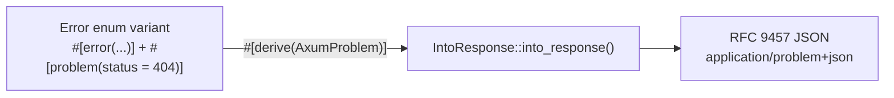

# axum-problem

[](https://crates.io/crates/axum-problem)
[](https://docs.rs/axum-problem)
[](https://github.com/biplabku/axum-problem/actions/workflows/ci.yml)
[](LICENSE-MIT)

RFC 9457 problem details for axum — `#[derive(AxumProblem)]` converts your error enums to structured HTTP error responses with one attribute.

```toml
[dependencies]
axum-problem = "0.1"
thiserror = "2"     # optional but recommended
```

---

## The problem

Every axum app needs structured error responses. Without a standard, every team reinvents it differently, risks leaking internal details to clients, and returns the wrong `Content-Type`.

```rust
// ❌ What you write today — 30+ lines of boilerplate per error type
impl IntoResponse for ApiError {
    fn into_response(self) -> Response {
        match self {
            Self::NotFound { id } => (StatusCode::NOT_FOUND,
                Json(json!({"error": "not found"}))).into_response(),
            Self::Database(e) => (StatusCode::INTERNAL_SERVER_ERROR,
                Json(json!({"error": "internal"}))).into_response(),
        }
    }
}
```

## The solution

```rust
// ✅ axum-problem: one attribute per variant
use axum_problem::AxumProblem;
use thiserror::Error;

#[derive(Debug, Error, AxumProblem)]
pub enum ApiError {
    #[error("order {id} not found")]
    #[problem(status = 404)]
    NotFound { id: i64 },

    #[error("access denied")]
    #[problem(status = 401)]
    Unauthorized,

    #[error("db error: {0}")]
    #[problem(status = 500, mask)]   // hides internal details from clients
    Database(String),
}

// Works directly in axum handlers
async fn get_order(Path(id): Path<i64>) -> Result<Json<Order>, ApiError> {
    db.find(id).await.map(Json).map_err(ApiError::Database)
}
```

HTTP response from `ApiError::NotFound { id: 1001 }`:

```
HTTP/1.1 404 Not Found
Content-Type: application/problem+json

{
  "title": "Not Found",
  "status": 404,
  "detail": "order 1001 not found"
}
```

---

## How it maps



Each variant's attributes map directly onto the RFC 9457 response fields:

```rust
#[error("order {id} not found")]     // ─┐
#[problem(                           //  │
    status = 404,                    // ─┼─▶ "status": 404, "title": "Not Found"
    title = "Order Missing"          // ─┼─▶ overrides the auto title above
)]                                    //  │
NotFound { id: i64 },                // ─┘─▶ Display impl becomes "detail"
```

```json
{
  "type": "about:blank",      // set via Problem::problem_type(), omitted otherwise
  "title": "Order Missing",   // from `title = "..."`, else derived from `status`
  "status": 404,              // from `status = <u16>`
  "detail": "order 1001 not found",  // the variant's Display output (omitted if `mask`)
  "instance": "/orders/1001"  // set via Problem::instance(), omitted otherwise
}
```

---

## Attributes

Apply `#[problem(...)]` to each variant:

| Attribute | Required | Description |
|---|---|---|
| `status = <u16>` | Yes | HTTP status code. Title auto-derived from the code. |
| `title = "<str>"` | No | Override the default title. |
| `mask` | No | Hides detail from HTTP response; logs it via `tracing` instead. |
| `log = "<level>"` | No | Only relevant when `mask` is set. Tracing level used to log the masked error: `"error"` (default), `"warn"`, `"info"`, or `"debug"`. |

### The `mask` attribute — production safety

Without `mask`, internal errors reach clients:

```
{"detail": "connection to 10.0.0.5:5432 refused"}  ← exposes your network
```

With `mask`:
```
{"title": "Internal Server Error", "status": 500}   ← clean client response
ERROR error="connection to 10.0.0.5:5432 refused" status=500  ← in your logs
```

Combine `mask` with `log` to control the log level for errors that are expected
to happen occasionally (rate limiting, etc.) instead of always logging at `error`:

```rust
#[error("rate limited: {0}")]
#[problem(status = 429, mask, log = "warn")]
RateLimited(String),
```

---

## All variant types supported

```rust
#[derive(Debug, Error, AxumProblem)]
pub enum ApiError {
    // Unit variant
    #[error("unauthorized")]
    #[problem(status = 401)]
    Unauthorized,

    // Struct variant (named fields)
    #[error("order {id} not found")]
    #[problem(status = 404)]
    NotFound { id: i64 },

    // Tuple variant
    #[error("validation: {0}")]
    #[problem(status = 422)]
    Validation(String),

    // Any variant + mask
    #[error("db: {0}")]
    #[problem(status = 500, mask)]
    Database(String),

    // Custom title
    #[error("email already taken")]
    #[problem(status = 409, title = "Email Conflict")]
    EmailConflict,
}
```

| Variant style | Example | Detail source |
|---|---|---|
| Unit | `Unauthorized` | Enum's `Display` |
| Struct (named fields) | `NotFound { id: i64 }` | Enum's `Display` |
| Tuple (1 field) | `Database(String)` | Enum's `Display` |
| Tuple (multiple fields) | `RateLimit(u32, u32)` | Enum's `Display` |
| Any + `mask` | `Database(String)` | Suppressed; logged via `tracing` |

All variants use the enum's `Display` implementation — so thiserror's `#[error("...")]` templates apply correctly.

---

## Manual construction

For one-off errors where a full enum is overkill:

```rust
use axum_problem::Problem;

Problem::not_found()
    .detail("The requested resource does not exist")
    .instance("/orders/1001")
```

Convenience constructors: `bad_request()`, `unauthorized()`, `forbidden()`,
`not_found()`, `method_not_allowed()`, `conflict()`, `unprocessable_entity()`,
`too_many_requests()`, `internal_server_error()`, `not_implemented()`,
`service_unavailable()`.

### RFC 9457 extension members

Add arbitrary top-level fields alongside the standard ones:

```rust
use serde_json::json;

Problem::new(422)
    .detail("Validation failed")
    .extension("violations", json!([
        {"field": "email", "message": "must be a valid email address"},
        {"field": "age",   "message": "must be at least 18"},
    ]))
    .extension("request_id", json!("req-abc-123"))
```

Produces:
```json
{
  "title": "Unprocessable Entity",
  "status": 422,
  "detail": "Validation failed",
  "violations": [...],
  "request_id": "req-abc-123"
}
```

Extension fields are serialized flat at the top level — not nested under an
`"extensions"` key — as RFC 9457 §3.5 requires.

---

## ProblemLayer — catch axum's own errors

axum's built-in extractors (bad JSON body, wrong Content-Type, missing fields)
return plain text errors, not `application/problem+json`. `ProblemLayer` fixes
this by intercepting any 4xx/5xx response that isn't already a problem response:

```rust
use axum::Router;
use axum_problem::ProblemLayer;

let app = Router::new()
    /* ... your routes ... */
    .layer(ProblemLayer);
```

Now every error — including axum extractor failures — returns structured
`application/problem+json`. Responses already in problem+json format pass
through unchanged (extension fields preserved). Apply `ProblemLayer` **last**
(outermost layer) so it catches errors from all other middleware and extractors.

---

## utoipa / OpenAPI integration

Enable the `utoipa` feature to expose `Problem` in your OpenAPI spec:

```toml
[dependencies]
axum-problem = { version = "0.1", features = ["utoipa"] }
utoipa = "4"
```

`Problem` implements `ToSchema` — use it directly in `#[utoipa::path]` responses:

```rust
#[utoipa::path(
    get, path = "/orders/{id}",
    responses(
        (status = 200, body = Order),
        (status = 404, body = Problem, description = "Order not found"),
        (status = 422, body = Problem, description = "Validation failed"),
        (status = 500, body = Problem, description = "Internal error"),
    )
)]
async fn get_order(Path(id): Path<i64>) -> Result<Json<Order>, ApiError> {
    // ...
}
```

The generated schema includes all RFC 9457 standard fields plus
`additionalProperties: true` to represent extension members.

---

## Works without thiserror

`AxumProblem` only requires `Display` — you can use it with any error type:

```rust
#[derive(Debug, AxumProblem)]
enum MyError {
    #[problem(status = 503)]
    Down,
}

impl std::fmt::Display for MyError {
    fn fmt(&self, f: &mut std::fmt::Formatter<'_>) -> std::fmt::Result {
        write!(f, "service is temporarily unavailable")
    }
}
impl std::error::Error for MyError {}
```

---

## Crates in this workspace

| Crate | Description |
|---|---|
| [`axum-problem`](axum-problem/) | Main library — `Problem` struct + `AxumProblem` re-export |
| [`axum-problem-derive`](axum-problem-derive/) | Proc-macro — `#[derive(AxumProblem)]` |

---

## Testing

77 unit and integration tests (plus doc-tests) covering the derive macro (all
variant styles), `ProblemLayer`, adversarial inputs (Unicode, long strings,
10k concurrent requests), RFC 9457 compliance, and security (masking field
values, chained error sources).

---

## Changelog

See [CHANGELOG.md](CHANGELOG.md) for release history.

---

## License

MIT OR Apache-2.0
